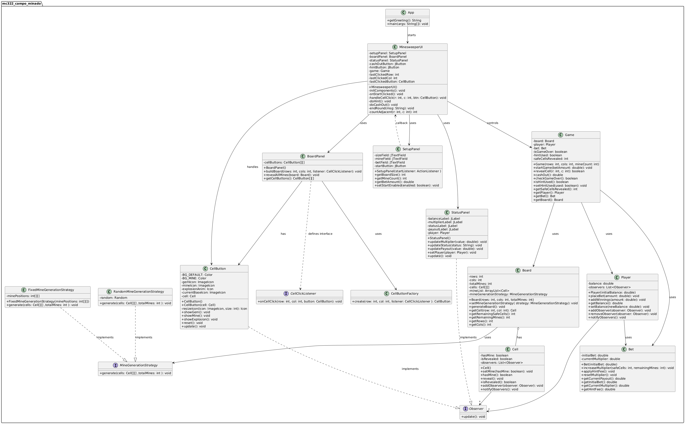

# 1. Relatório Final - Jogo bet campo minado 

**Data de submissão:** 23/06/2025  
**Disciplina:** MC322 – Programação Orientada a Objetos  
**Link Repositório GitHub**: https://github.com/mariamxavier/MC322_Campo_Minado.git

**Integrantes:** 

**Name:** Maria Eduarda Xavier Messias  **RA:** 183611 

**Name:** Pedro Augusto de Oliveira Fernandes **RA:** 244181

**Name:** Everton Mendes de Almeida**RA:** 260426   

---


## 1.2. Visão Geral

A ideia surgiu de misturar o clássico Campo Minado com um esquema de aposta: você coloca um valor, vai clicando nas casas e, a cada acerto, o multiplicador sobe — mas se bater numa mina, perdeu tudo. Pra deixar mais interessante, incluímos dicas pagas: você pode comprar uma ajudinha que revela informação local (quantas minas tem ao redor do último clique) descontando uma porcentagem do seu payout.

Principais pontos:
- **Tabuleiro**: quadrado NxN, você escolhe o tamanho.  
- **Minas**: colocadas de forma aleatória (ou fixa, pra facilitar testes).  
- **Aposta inicial**: o valor sai do seu saldo assim que a rodada começa.  
- **Multiplicador**: aumenta conforme você revela casas seguras, calculado pela probabilidade (casas seguras restantes vs. minas).  
- **Cash Out**: quando quiser, encerra a rodada e leva a grana que acumula (aposta × multiplicador).  
- **Dicas pagas**: você paga uma taxa para ver dicas ao redor da última casa clicada.

O jogo junta:
- Lógica de Campo Minado (POO, recursão para abrir adjacências, contagem de minas).  
- Interface Swing bem modular (SetupPanel, BoardPanel, StatusPanel, botões customizados).  
- Sistema de apostas com gestão de saldo, ganhos e perdas.

## 1.3. Ambiente e Ferramentas

Pra desenvolver, escolhemos um stack simples e moderno:

- **Java 21 (Eclipse Adoptium)**: aproveitamos as melhorias de performance e as novas APIs.  
- **Gradle 8.8**: nosso build tool, para compilar, testar e gerar Javadoc sem dor.  
- **JUnit 5**: testes unitários integrados ao Gradle (com `useJUnitPlatform()`).  
- **PlantUML**: diagramas UML direto no Markdown, sem sair do repositório.  
- **IDE**: usamos IntelliJ IDEA, mas tudo roda num VS Code com extensão Java.  

Além disso:
- Recursos gráficos (ícones PNG/GIF) estão em `src/main/resources/assets`.  
- Relatórios de teste ficam em `build/reports/tests` e Javadoc em `build/docs/javadoc`.  

## 1.4. Evolução do Código

Ao longo do desenvolvimento colaborativo, buscou-se refinar gradualmente a estrutura do projeto, estabelecendo responsabilidades bem definidas e aplicando padrões de projeto de maneira consciente.

### 1.4.1. 3.1 Protótipo Inicial
- No estágio inicial, toda a lógica de jogo e a interface encontravam-se concentradas em uma única classe `Minesweeper.java`.  
- Embora funcional, tal abordagem comprometeu a manutenibilidade e os testes automatizados.  

### 1.4.2. 3.2 Refatoração Orientada a Objetos
1. **`Cell`**: encapsula o estado `hasMine` e `isRevealed`, expondo métodos `reveal()` e `setMine()`, além de registro de observadores.  
2. **`Board`**: introduz matriz `Cell[][]` com injeção de estratégia (`MineGenerationStrategy`) para posicionamento de minas.  
3. **`Game`**, **`Player`** e **`Bet`**: extraem a lógica de fluxo de partida e de gestão de apostas, isolando responsabilidades.  

### 1.4.3. 3.3 Consolidação dos Design Patterns
- **Observer**: `Cell` e `Player` passaram a notificar `CellButton` e `StatusPanel`.  
- **Strategy**: definiram-se `RandomMineGenerationStrategy` e `FixedMineGenerationStrategy`.  
- **Factory Method**: `CellButtonFactory.create(...)` centraliza a criação e configuração de botões.  

### 1.4.4. 3.4 Integração de Apostas e UI Modular
- Implementou-se `Bet` para cálculo de multiplicador e taxa de dica (hint fee).  
- `MinesweeperUI` foi reestruturado em painéis (`SetupPanel`, `BoardPanel`, `StatusPanel`) e adicionou-se botões “Hint” e “Cash Out”.  

### 1.4.5. 3.5 Versão Final e Testes
- Foram criados testes com JUnit 5 (`BetTest`, `CellTest`, `BoardTest`, `GameTest`), cobrindo fluxos normais e cenários de exceção.  
- A documentação Javadoc foi gerada automaticamente via Gradle.  
- Ajustes visuais finais: ícones redimensionáveis, tema neon e animações de explosão.

## 1.5. Arquitetura e Diagrama UML

A arquitetura adotada segue o padrão MVC (Model-View-Controller), garantindo separação clara de responsabilidades:

- **Model**: encapsula estado e regras de negócio, representado pelas classes `Cell`, `Board`, `Game`, `Player` e `Bet`.  
- **View**: fornece a interface gráfica, composta por `SetupPanel`, `BoardPanel`, `CellButton` (via `CellButtonFactory`) e `StatusPanel`.  
- **Controller**: coordena interações do usuário e lógica de fluxo, implementado em `MinesweeperUI`.

A seguir, o diagrama de classes em PlantUML:

<p align="center">
  
</p>


O diagrama evidencia:

- **Strategy** para flexibilidade na geração de minas, permitindo trocar estratégias sem alterar o `Board`.  
- **Observer** para atualização automática dos componentes visuais (`CellButton` e `StatusPanel`) sempre que o estado do modelo muda.  
- **Factory Method** para instanciar `CellButton` de forma padronizada, centralizando tema, ícones e listeners.

---

## 1.6. Principais Padrões de Projeto

1. **Observer**  
   - Classes `Cell` e `Player` implementam o papel de *subject*.  
   - `CellButton` e `StatusPanel` registram-se como *observers*, recebendo notificações de mudanças de estado e atualizando a UI sem acoplamento direto.

2. **Strategy**  
   - Interface `MineGenerationStrategy` define o contrato para posicionamento de minas.  
   - `RandomMineGenerationStrategy` (jogo real) e `FixedMineGenerationStrategy` (testes) são intercambiáveis, favorecendo testes determinísticos.

3. **Factory Method**  
   - Classe `CellButtonFactory` expõe o método estático `create(cell, row, col, listener)`.  
   - Centraliza propriedades visuais (íconização, hover, tamanho) e registra o listener de clique, isolando essa lógica do `BoardPanel`.

---

## 1.7. Testes Unitários

Localização: `src/test/java/mc322_campo_minado`

- **BetTest.java**  
  Verifica:
  - Construtor e validações.  
  - `increaseMultiplier()` e atualizações do multiplicador.  
  - Cálculo de `getCurrentPayout()` e `getHintFee()`.  
  - `applyHintFee()` e `resetMultiplier()`.

- **CellTest.java**  
  Verifica:
  - Estado inicial de `Cell`.  
  - Comportamento de `setMine()` e `reveal()`.  
  - Notificações e remoção de observers.

- **BoardTest.java**  
  Verifica:
  - Geração de minas usando `RandomMineGenerationStrategy`.  
  - Geração fixa com `FixedMineGenerationStrategy`.

- **GameTest.java**  
  Simula:
  - Início de jogo (`startGame()`) e dedução de aposta.  
  - Sequência de `revealCell()` em células seguras e atualização de multiplicador.  
  - Clique em mina -> `checkGameOver()` e perda de aposta.  
  - `cashOut()` retorna valor correto e atualiza saldo do `Player`.

**Comando para execução:**
```bash
# Linux/macOS
./gradlew clean test
# Windows
gradlew.bat clean test
```

## 1.8. Considerações Finais

- A evolução seguiu uma progressão incremental, desde o protótipo monolítico até a arquitetura modular com MVC e padrões de projeto.  
- A cobertura de testes e a documentação Javadoc garantem qualidade e mantenibilidade conforme visto em aula e desenvolvido nos 3 laboratórios.  

